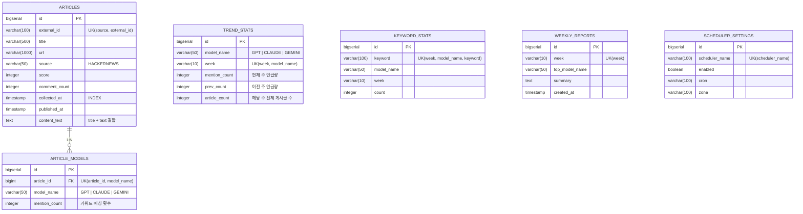

<p align="center">
  
  
  
  
  
  
</p>

<h1 align="center">🚀 BenchMark — AI 트렌드 대시보드</h1>

<p align="center">
  <strong>HackerNews Top Stories에서 GPT · Claude · Gemini 언급량을 자동 수집, 분석하여<br/>
  "이번 주 어떤 AI가 가장 핫한가?"를 한눈에 보여주는 개발자용 트렌드 대시보드</strong>
</p>

---

## 📌 목차

| # | 섹션 | 설명 |
|:-:|------|------|
| 1 | [프로젝트 개요](#-프로젝트-개요) | 왜 만들었는지, 무엇을 하는지 |
| 2 | [핵심 기능 상세](#-핵심-기능-상세) | 수집 → 분석 → 집계 → 대시보드 |
| 3 | [아키텍처 & 데이터 흐름](#-아키텍처--데이터-흐름) | 전체 시스템 구조 다이어그램 |
| 4 | [핵심 디자인 패턴](#-핵심-디자인-패턴) | CoR, Strategy, Factory Method 등 |
| 5 | [기술 스택](#-기술-스택) | Backend · DB · Frontend · DevOps |
| 6 | [ERD (데이터 모델)](#-erd-데이터-모델) | 6개 테이블 Mermaid ERD |
| 7 | [패키지 구조](#-패키지-구조) | 전체 55개 Java 파일 트리 |
| 8 | [API 엔드포인트](#-api-엔드포인트) | MVC 라우팅 + REST API |
| 9 | [스케줄러 동작 방식](#-스케줄러-동작-방식) | DB 기반 동적 Cron 상세 |
| 10 | [환경 변수](#-환경-변수) | 설정 가능한 전체 변수 목록 |
| 11 | [실행 방법](#-실행-방법) | 로컬 · Docker · 클라우드 |
| 12 | [기술적 어필 포인트](#-기술적-어필-포인트) | 포트폴리오 관점 핵심 강점 |

---

## 📋 프로젝트 개요

BenchMark는 개발자 커뮤니티(HackerNews)에서 **상위 인기 게시글(Top Stories)을 자동 수집**하고, 게시글 제목·본문에서 AI 모델 키워드를 **분석·집계**하여 주간 트렌드를 시각화하는 **풀스택 웹 애플리케이션**입니다.

### 💡 왜 만들었나?

| 동기 | 설명 |
|------|------|
| 🔍 **정보 수집 자동화** | 매일 HackerNews를 직접 뒤지지 않고도 **AI 모델별 언급 동향**을 한눈에 파악 |
| 🏗 **실전 파이프라인** | 단순 CRUD가 아닌 **외부 API 연동 → 데이터 분석 → 집계 → 시각화**까지 구현 |
| 🎨 **디자인 패턴 적용** | **Chain of Responsibility**, **비동기 병렬 처리**, **DB 기반 동적 스케줄러** 등 실무 기술 적용 |

### 📊 한눈에 보는 프로젝트 규모

```
📁 프로젝트 구성 요약
├── Java 파일       : 55개
├── 엔티티(Entity)  : 6개 (articles, article_models, trend_stats, keyword_stats, weekly_reports, scheduler_settings)
├── 서비스 인터페이스 : 10개 (모두 인터페이스 + 구현체 분리)
├── 컨트롤러        : 5개 (MVC 3개 + REST API 2개)
├── 핸들러 체인     : 4개 (CoR 패턴)
├── DTO (record)    : 5개 + 1개 VO
├── Repository      : 6개 (JPA + JPQL 커스텀 쿼리)
├── 템플릿 (HTML)   : 3개 (home, admin/index, admin/schedule)
├── CSS             : 1개 (app.css — 커스텀 디자인 시스템)
└── Dockerfile      : 1개 (멀티 스테이지 빌드)
```

---

## 🎯 핵심 기능 상세

### 1️⃣ HackerNews 자동 수집 엔진

| 항목 | 설명 |
|------|------|
| **수집 대상** | HackerNews Top Stories (상위 30개) |
| **API 클라이언트** | `RestClient` + `CompletableFuture` **8스레드 병렬** 호출 |
| **수집 주기** | `SchedulingConfigurer` 기반 **동적 Cron** (기본: 매일 09:00 KST) |
| **중복 방지** | `source + external_id` 유니크 제약조건으로 **DB 레벨 보장** |
| **결과 통계** | `fetched` · `saved` · `aiMatched` · `duplicate` · `invalid` · `skipped` **6개 지표** 추적 |

> 📡 **수집 파이프라인 흐름**
>
> ```
> HackerNews Firebase API                      DB 저장
> ┌──────────────────┐                    ┌──────────┐
> │ /v0/topstories   │ ──▶ ID 30개 추출 ──▶ 개별 조회 ──▶ 평가 ──▶ 핸들러 체인 ──▶ │ articles │
> │ /v0/item/{id}    │    (병렬 8스레드)              │                     │ + models │
> └──────────────────┘                                                     └──────────┘
> ```

### 2️⃣ AI 모델 키워드 분석

게시글의 **`title + text`** 에서 아래 키워드를 감지하면 해당 모델의 언급으로 카운트합니다:

| AI 모델 | 감지 키워드 | 비고 |
|---------|------------|------|
| **GPT** | `gpt`, `gpt-4`, `gpt-4o`, `chatgpt`, `openai` | OpenAI 계열 전체 |
| **Claude** | `claude`, `anthropic`, `claude-3`, `sonnet`, `opus` | Anthropic 계열 전체 |
| **Gemini** | `gemini`, `google ai`, `bard`, `gemini pro` | Google 계열 전체 |

> ⚙️ **분석 로직 특징**
> - 하나의 게시글이 **여러 모델을 동시에 언급** 가능 (예: "GPT vs Claude 비교")
> - 단순 포함 여부가 아닌 **언급 강도(`mention_count`)**를 함께 저장
> - `ArticleModelAnalyzerImpl`에서 대소문자 무시(`toLowerCase`) 정규화 후 매칭

### 3️⃣ 주간 트렌드 집계

| 항목 | 설명 |
|------|------|
| **집계 시점** | 수집 완료 시 자동 트리거 (`TrendAggregationService.refreshCurrentWeekStats()`) |
| **집계 범위** | **현재 주 + 이전 주** 언급량 동시 집계 |
| **증감률** | **전주 대비 증감률(%)** 자동 계산 → 대시보드 표시 |
| **주차 기준** | `2025-W11` 형식의 **ISO 주차** 기준 관리 (`WeekService`) |

### 4️⃣ 관리자 대시보드

| 기능 | URL | 설명 |
|------|-----|------|
| 🏠 관리자 메인 | `GET /admin/main` | 현재 스케줄러 상태 확인 |
| ⏰ 스케줄 설정 | `GET /admin/schedule` | 수집 스케줄 ON/OFF, 실행 시간·타임존 변경 |
| ▶️ 수동 수집 | `POST /api/collect/hacker-news` | 버튼 클릭으로 즉시 수집 트리거 |

> 🛠 **스케줄 설정 UI**: AM/PM, 시, 분, 초, 타임존을 개별 입력 → Cron 표현식 자동 생성 → DB 반영

### 5️⃣ 메인 대시보드 (사용자 화면)

| 섹션 | 설명 |
|------|------|
| **🤖 Automatic Collection** | 스케줄러 ON/OFF 상태, 다음 실행 시간 표시 |
| **📈 This Week** | 모델별 주간 언급량 랭킹 + 전주 대비 증감률(%) |
| **📰 Recent Articles** | 수집된 게시글 Top 5 (최신순/점수순 **AJAX 비동기** 정렬 전환) |

---

## 🏗 아키텍처 & 데이터 흐름

```
┌──────────────────────────────────────────────────────────────────────────┐
│                         Spring Scheduler                                 │
│              (SchedulingConfigurer — DB 기반 동적 Cron)                  │
│              ThreadPool: 1 스레드, prefix: "hacker-news-scheduler-"     │
└──────────────────────────────┬───────────────────────────────────────────┘
                               │ 트리거 (enabled=true일 때만)
                               ▼
┌──────────────────────────────────────────────────────────────────────────┐
│                      CollectServiceImpl                                  │
│                                                                          │
│  ① HackerNewsClientImpl.fetchTopStoryIds(30)                            │
│       └─ RestClient → GET /v0/topstories.json                           │
│                                                                          │
│  ② HackerNewsClientImpl.fetchItems(ids)                                 │
│       └─ CompletableFuture × 8 스레드 병렬 호출                          │
│       └─ GET /v0/item/{id}.json (개별 조회)                              │
│       └─ 실패 시 null 반환 → filter 제외 (graceful 에러 처리)            │
│                                                                          │
│  ③ 각 아이템 → Evaluator 평가 → Chain of Responsibility 핸들러 체인     │
│       ┌──────────────────────────────────────────────┐                   │
│       │  @Order(1) InvalidHandler   → INVALID        │ 삭제/비공개/제목없음│
│       │  @Order(2) NonAiHandler     → NON_AI         │ AI 키워드 미포함  │
│       │  @Order(3) DuplicateHandler → DUPLICATE      │ DB 중복 체크      │
│       │  @Order(4) SaveHandler      → SAVED ✅       │ DB 저장           │
│       └──────────────────────────────────────────────┘                   │
│                                                                          │
│  ④ HackerNewsCollectAccumulator — 6개 지표 누적 추적                    │
│                                                                          │
│  ⑤ TrendAggregationService.refreshCurrentWeekStats()                    │
│       └─ 현재 주 + 이전 주 모델별 언급량 재집계                          │
└──────────────────────────────────────────────────────────────────────────┘
                               │
                               ▼
┌──────────────────────────────────────────────────────────────────────────┐
│                     PostgreSQL (Neon Cloud)                               │
│                                                                          │
│    articles ────1:N───▶ article_models                                   │
│    trend_stats          keyword_stats         weekly_reports             │
│    scheduler_settings                                                    │
│                                                                          │
│    총 6개 테이블 · JPA ddl-auto: update · SSL 연결                       │
└──────────────────────────────┬───────────────────────────────────────────┘
                               │
                               ▼
┌──────────────────────────────────────────────────────────────────────────┐
│                사용자 접속 (Thymeleaf SSR + Vanilla JS)                   │
│                                                                          │
│    GET  /              → 메인 대시보드 (SSR 렌더링)                      │
│    GET  /api/articles  → AJAX 비동기 정렬 전환 (Fetch API)               │
│    GET  /api/trends/summary → 트렌드 요약 JSON                          │
│    GET  /admin/*       → 관리자 페이지 (스케줄 관리)                     │
│    POST /admin/schedule → 스케줄 설정 변경                               │
│    POST /api/collect/hacker-news → 수동 수집 트리거                      │
└──────────────────────────────────────────────────────────────────────────┘
```

---

## 🔧 핵심 디자인 패턴

### 🔗 1. Chain of Responsibility — 수집 아이템 처리 파이프라인

수집된 HackerNews 아이템은 **4단계 핸들러 체인**을 순서대로 거치며, 첫 번째로 `supports()` 조건을 만족하는 핸들러가 처리합니다:

```
HackerNewsItemDto
    │
    ▼  HackerNewsItemEvaluator.evaluate()
    │  └── AI 모델 매칭 결과가 담긴 HackerNewsItemEvaluation 생성
    │       └── 팩토리 메서드: invalid() / nonAi() / matched(models)
    ▼
HackerNewsItemProcessContext (item + evaluation 래핑)
    │
    ▼  processHandlers.stream().filter(supports).findFirst()
┌────────────────────────────────┐
│ ① InvalidHandler    (@Order 1) │ ── deleted/dead/title없음 → INVALID (스킵)
└────────────┬───────────────────┘
             ▼
┌────────────────────────────────┐
│ ② NonAiHandler      (@Order 2) │ ── AI 키워드 미포함 → NON_AI (스킵)
└────────────┬───────────────────┘
             ▼
┌────────────────────────────────┐
│ ③ DuplicateHandler  (@Order 3) │ ── DB에 이미 존재 → DUPLICATE (스킵)
└────────────┬───────────────────┘
             ▼
┌────────────────────────────────┐
│ ④ SaveHandler        (@Order 4) │ ── 모든 검증 통과 → 저장 → SAVED ✅
└────────────────────────────────┘
```

**왜 이 패턴을 적용했나?**

| 원칙 | 효과 |
|------|------|
| **개방-폐쇄 원칙 (OCP)** | 새 필터 조건 추가 시 핸들러 클래스 1개만 추가 |
| **단일 책임 원칙 (SRP)** | 각 핸들러는 하나의 판단 기준만 담당 |
| **Spring `@Order`** | 실행 순서를 애노테이션으로 **선언적** 관리 |
| **확장 용이** | 예: `@Order(2.5)`로 "특정 키워드 필터" 핸들러를 사이에 삽입 가능 |

### 🧩 2. Strategy Pattern — 서비스 인터페이스 분리

모든 서비스가 **인터페이스 + 구현체** 형태로 분리. 테스트 용이성과 구현체 교체 가능성 확보:

```
┌──────────────────────────┐     ┌──────────────────────────────────┐
│      Interface           │ ──▶ │         Implementation           │
├──────────────────────────┤     ├──────────────────────────────────┤
│ CollectService           │ ──▶ │ CollectServiceImpl               │
│ HackerNewsClient         │ ──▶ │ HackerNewsClientImpl             │
│ HackerNewsItemEvaluator  │ ──▶ │ HackerNewsItemEvaluatorImpl      │
│ ArticleModelAnalyzer     │ ──▶ │ ArticleModelAnalyzerImpl         │
│ ArticleIngestionService  │ ──▶ │ ArticleIngestionServiceImpl      │
│ ArticleService           │ ──▶ │ ArticleServiceImpl               │
│ TrendService             │ ──▶ │ TrendServiceImpl                 │
│ TrendAggregationService  │ ──▶ │ TrendAggregationServiceImpl      │
│ WeekService              │ ──▶ │ WeekServiceImpl                  │
│ SchedulerSettingsService │ ──▶ │ SchedulerSettingsServiceImpl     │
└──────────────────────────┘     └──────────────────────────────────┘
                  총 10쌍의 인터페이스-구현체 분리
```

### 🏭 3. Factory Method — 평가 결과 생성

```java
// HackerNewsItemEvaluation — 의미 있는 팩토리 메서드로 평가 결과 캡슐화
HackerNewsItemEvaluation.invalid()        // 무효 아이템
HackerNewsItemEvaluation.nonAi()          // AI 키워드 미포함
HackerNewsItemEvaluation.matched(models)  // AI 모델 매칭 성공
```

### 📋 4. Template Method — 핸들러 처리 흐름 표준화

```
HackerNewsItemProcessHandler 인터페이스:
    supports(context) → boolean     // 이 핸들러가 처리 가능한지 판단
    handle(context)   → Status      // 실제 처리 로직
    log(context)      → void        // 로깅
```

---

## 🛠 기술 스택

### Backend

| 구분 | 기술 | 버전 | 사용 목적 |
|------|------|------|----------|
| **Language** | Java | 17 | Record 클래스, 텍스트 블록, `formatted()` 등 모던 문법 활용 |
| **Framework** | Spring Boot | 3.3.2 | 자동 설정, 내장 톰캣, DI/AOP |
| **DI Manager** | Spring Dependency Management | 1.1.6 | BOM 기반 버전 관리 |
| **ORM** | Spring Data JPA (Hibernate) | — | 엔티티 매핑, JPQL 커스텀 쿼리, `Pageable` |
| **Template** | Thymeleaf | — | 서버 사이드 렌더링, `th:text` 자동 XSS 이스케이프 |
| **HTTP Client** | RestClient (Spring 6.1+) | — | HackerNews Firebase API 동기 호출 |
| **Async** | `CompletableFuture` + `ExecutorService` | — | **8스레드 병렬** API 호출 |
| **Scheduling** | `SchedulingConfigurer` + `CronTrigger` | — | DB 기반 동적 스케줄 관리 |
| **Utility** | Lombok | — | `@Getter`, `@Setter`, `@RequiredArgsConstructor` 등 |
| **DevTools** | Spring Boot DevTools | — | 개발 시 자동 리로드 |

### Database & Infra

| 구분 | 기술 | 사용 목적 |
|------|------|----------|
| **DB** | PostgreSQL (Neon Cloud) | 클라우드 호스팅, SSL 연결, Connection Pooling |
| **DDL** | JPA `ddl-auto: update` | 개발 시 자동 스키마 생성·갱신 |
| **Build** | Gradle 8.x + Gradle Wrapper | 의존성 관리, 빌드 자동화, 환경 독립적 빌드 |
| **Container** | Docker (멀티 스테이지) | `eclipse-temurin:17-jdk`(빌드) → `eclipse-temurin:17-jre`(실행) |
| **Config** | `.env` + `application.yml` | `spring.config.import: optional:file:.env[.properties]` |

### Frontend

| 구분 | 기술 | 사용 목적 |
|------|------|----------|
| **SSR** | Thymeleaf | 초기 페이지 서버 렌더링 (`th:text`, `th:each`, `th:attr`) |
| **Client JS** | Vanilla JavaScript (ES2020+) | Fetch API 기반 AJAX 비동기 갱신 |
| **CSS** | Custom CSS (`app.css`, 16KB) | 커스텀 디자인 시스템, 반응형 레이아웃 |
| **보안** | `escapeHtml()` / `escapeAttribute()` | 클라이언트 사이드 XSS 방어 |

---

## 🗄 ERD (데이터 모델)



### 📊 테이블별 역할 상세

| 테이블 | 역할 | 핵심 제약조건 | JPA 엔티티 |
|--------|------|--------------|------------|
| `articles` | 외부 소스에서 수집한 원본 게시글 | `UK(source, external_id)` — 중복 수집 방지<br/>`IDX(collected_at)` — 시간순 조회<br/>`IDX(source)` — 소스별 필터 | `Article.java` |
| `article_models` | 게시글-AI모델 매핑 (1:N) | `UK(article_id, model_name)` — 모델별 1레코드<br/>`IDX(article_id)` — 조인 최적화<br/>`IDX(model_name)` — 모델별 필터 | `ArticleModel.java` |
| `trend_stats` | 주간 모델별 집계 (대시보드 표시용) | `UK(week, model_name)` — 주차-모델 단위 유일 | `TrendStat.java` |
| `keyword_stats` | 모델별 주간 키워드 빈도 | `UK(week, model_name, keyword)` | `KeywordStat.java` |
| `weekly_reports` | 주간 요약 리포트 | `UK(week)` — 주당 1개 리포트 | `WeeklyReport.java` |
| `scheduler_settings` | 스케줄러 동적 설정 (DB 저장) | `UK(scheduler_name)` — 스케줄러별 단일 설정 | `SchedulerSetting.java` |

---

## 📁 패키지 구조

```
src/main/java/kr/co/glab/benchmark/
│
├── 📄 BenchMarkApplication.java             # @SpringBootApplication, @EnableScheduling
│                                             # @EnableConfigurationProperties(SchedulerProperties.class)
│
├── 📂 config/
│   └── SchedulerProperties.java              # @ConfigurationProperties("scheduler.hacker-news")
│                                             # → enabled, cron, zone YAML 바인딩
│
├── 📂 controller/                            # 🌐 MVC 컨트롤러 (3개)
│   ├── HomeController.java                   # GET / → 메인 대시보드
│   │   └── 모델: summary, recentArticles, articleSort, currentWeek,
│   │           schedulerEnabled, schedulerTime, schedulerZone
│   ├── AdminController.java                  # GET /admin → redirect /admin/main
│   │                                         # GET /admin/main → 관리자 메인
│   │                                         # GET /admin/schedule → 스케줄 설정 페이지
│   └── AdminScheduleController.java          # POST /admin/schedule → 스케줄 변경
│       └── AM/PM, 시, 분, 초 → Cron 자동 변환 (to24Hour 메서드)
│       └── 유효성 검증: meridiem, hour(1-12), minute(0-59), second(0-59)
│
│   └── 📂 api/                               # 🔌 REST API 컨트롤러 (2개)
│       ├── TrendApiController.java           # GET /api/trends/summary → 주간 트렌드 JSON
│       │                                     # GET /api/articles?sort=latest|score → 게시글 Top 5
│       └── CollectApiController.java         # POST /api/collect/hacker-news → 수동 수집 트리거
│           └── 응답: message + stats + summary + articles
│
├── 📂 service/                               # ⚙️ 비즈니스 로직 (10쌍 + 핸들러 4개 + 보조 3개)
│   │
│   │── CollectService / CollectServiceImpl          # 수집 오케스트레이션 (트랜잭션 관리)
│   │── HackerNewsClient / HackerNewsClientImpl      # HN API 호출 (RestClient + 8스레드 병렬)
│   │── HackerNewsItemEvaluator / ...Impl            # 아이템 유효성 + AI 분석 평가
│   │── ArticleModelAnalyzer / ...Impl               # AI 모델 키워드 매칭 엔진
│   │── ArticleIngestionService / ...Impl            # Article + ArticleModel DB 저장
│   │── ArticleService / ...Impl                     # 게시글 조회 (정렬/페이징)
│   │── TrendService / ...Impl                       # 트렌드 요약 조회 + 증감률 계산
│   │── TrendAggregationService / ...Impl            # 주간 집계 로직
│   │── WeekService / ...Impl                        # ISO 주차 계산 유틸
│   │── SchedulerSettingsService / ...Impl           # DB 기반 스케줄 설정 관리
│   │
│   │── 📂 Chain of Responsibility 핸들러 (4개)
│   │   ├── HackerNewsItemProcessHandler.java         # 핸들러 인터페이스 (supports/handle/log)
│   │   ├── InvalidHackerNewsItemProcessHandler.java  # @Order(1) — 삭제/dead/제목없음
│   │   ├── NonAiHackerNewsItemProcessHandler.java    # @Order(2) — AI 키워드 미포함
│   │   ├── DuplicateHackerNewsItemProcessHandler.java# @Order(3) — DB 중복 체크
│   │   └── SaveHackerNewsItemProcessHandler.java     # @Order(4) — DB 저장 실행
│   │
│   │── 📂 보조 클래스 (VO / Enum / Accumulator)
│   │   ├── HackerNewsItemEvaluation.java             # 평가 결과 VO (팩토리 메서드 패턴)
│   │   ├── HackerNewsItemProcessContext.java         # 핸들러 컨텍스트 (item + evaluation)
│   │   ├── HackerNewsItemProcessStatus.java          # SAVED | DUPLICATE | INVALID | NON_AI
│   │   ├── HackerNewsCollectAccumulator.java         # 수집 통계 누적기 (6개 카운터)
│   │   └── SchedulerSettingsView.java                # 스케줄러 설정 뷰 (record)
│
├── 📂 scheduler/
│   └── CollectSchedulingConfig.java          # SchedulingConfigurer 구현
│       └── 매 실행마다 DB에서 Cron 읽기 → CronTrigger 동적 적용
│       └── enabled=false 시 1분 후 재확인 (풀링 방식)
│
├── 📂 entity/                                # 🗃 JPA 엔티티 (6개)
│   ├── Article.java                          # articles — 인덱스 2개 + UK 1개
│   ├── ArticleModel.java                    # article_models — @ManyToOne(LAZY) + 인덱스 2개 + UK 1개
│   ├── TrendStat.java                       # trend_stats — 주간 모델별 집계
│   ├── KeywordStat.java                     # keyword_stats — 키워드 빈도
│   ├── WeeklyReport.java                    # weekly_reports — 주간 리포트
│   └── SchedulerSetting.java               # scheduler_settings — 동적 스케줄 설정
│
├── 📂 dto/                                   # 📦 DTO — 모두 Java Record
│   ├── TrendSummaryDto.java                  # 주간 트렌드 요약 (modelName, week, mentionCount, prevCount, articleCount, growthRate)
│   ├── ArticleSummaryDto.java                # 게시글 요약 (title, url, source, score, commentCount, collectedAt)
│   ├── HackerNewsItemDto.java                # HN API 응답 (id, deleted, type, by, time, text, dead, title, score, url, descendants)
│   ├── HackerNewsCollectStatsDto.java        # 수집 통계 (fetched/saved/aiMatched/duplicate/invalid/skipped)
│   └── HackerNewsCollectResponseDto.java     # 수집 API 응답 (message, stats, summary, articles)
│
├── 📂 repository/                            # 🗄 JPA Repository (6개)
│   ├── ArticleRepository.java                # findBySourceAndExternalId (중복 체크), JPQL
│   ├── ArticleModelRepository.java           # findByArticleCollectedAtBetween (주간 집계)
│   ├── TrendStatRepository.java              # findByWeekAndModelName, findByWeekOrderByMentionCountDesc
│   ├── KeywordStatRepository.java            # 키워드 통계
│   ├── WeeklyReportRepository.java           # 주간 리포트
│   └── SchedulerSettingRepository.java       # findBySchedulerName
│
├── 📂 batch/                                 # (향후 확장 예정)
├── 📂 client/                                # (향후 확장 예정)
└── 📂 security/                              # (향후 확장 예정)

src/main/resources/
├── application.yml                           # DB, JPA, 스케줄러, 서버 포트 설정
│   └── spring.config.import: optional:file:.env[.properties]
├── rebel.xml                                 # JRebel 핫 리로드 설정
│
├── 📂 static/
│   └── 📂 css/
│       └── app.css                           # 커스텀 디자인 시스템 (16KB)
│
└── 📂 templates/                             # Thymeleaf HTML 템플릿
    ├── home.html                             # 메인 대시보드 (SSR + AJAX)
    │   └── 인라인 JS: Fetch API, escapeHtml, escapeAttribute
    └── 📂 admin/
        ├── index.html                        # 관리자 메인 (스케줄러 상태)
        └── schedule.html                     # 스케줄 설정 폼 (AM/PM 입력)
```

---

## 🌐 API 엔드포인트

### 📄 MVC 페이지 라우팅

| Method | URL | Controller | 뷰 | 설명 |
|:------:|-----|------------|-----|------|
| `GET` | `/` | `HomeController` | `home.html` | 메인 대시보드 (트렌드 요약 + 최근 게시글) |
| `GET` | `/admin` | `AdminController` | — | → `/admin/main` 리다이렉트 |
| `GET` | `/admin/main` | `AdminController` | `admin/index.html` | 관리자 메인 (스케줄러 상태) |
| `GET` | `/admin/schedule` | `AdminController` | `admin/schedule.html` | 스케줄 설정 페이지 |
| `POST` | `/admin/schedule` | `AdminScheduleController` | — | 스케줄 변경 → redirect |

> 📌 `POST /admin/schedule` 파라미터: `enabled`, `meridiem` (AM/PM), `hour` (1-12), `minute` (0-59), `second` (0-59), `zone`

### 🔌 REST API

| Method | URL | Controller | Request | Response |
|:------:|-----|------------|---------|----------|
| `GET` | `/api/trends/summary` | `TrendApiController` | — | `List<TrendSummaryDto>` |
| `GET` | `/api/articles?sort=latest\|score` | `TrendApiController` | `sort` (기본: latest) | `List<ArticleSummaryDto>` |
| `POST` | `/api/collect/hacker-news` | `CollectApiController` | `articleSort` (기본: latest) | `HackerNewsCollectResponseDto` |

### 📨 수집 API 응답 예시

```json
{
  "message": "Hacker News 수집 완료: 30건 조회, 5건 저장, 3건 AI 매칭, 2건 중복, 10건 무효, 10건 스킵",
  "stats": {
    "fetchedCount": 30,
    "savedCount": 5,
    "aiMatchedCount": 3,
    "duplicateCount": 2,
    "invalidCount": 10,
    "skippedCount": 10
  },
  "summary": [
    { "modelName": "GPT", "week": "2025-W11", "mentionCount": 15, "prevCount": 10, "articleCount": 5, "growthRate": 50.0 },
    { "modelName": "CLAUDE", "week": "2025-W11", "mentionCount": 8, "prevCount": 12, "articleCount": 3, "growthRate": -33.3 }
  ],
  "articles": [
    { "title": "GPT-4o is now available...", "url": "https://...", "source": "HACKERNEWS", "score": 350, "commentCount": 120, "collectedAt": "2025-03-20T09:00:00" }
  ]
}
```

---

## ⏰ 스케줄러 동작 방식

BenchMark의 스케줄러는 일반적인 `@Scheduled` 고정 Cron이 아니라, **DB에서 설정을 읽어 동적으로 Cron을 변경**할 수 있는 구조입니다:

```
┌───────────────────────────────────────────────────────────────┐
│            CollectSchedulingConfig                             │
│            implements SchedulingConfigurer                     │
│                                                               │
│  ┌─────────────────────────────────────────────┐              │
│  │  Trigger.nextExecution(TriggerContext)       │              │
│  │                                             │              │
│  │  ① DB에서 SchedulerSetting 조회             │              │
│  │     └─ schedulerName = "hacker-news"        │              │
│  │                                             │              │
│  │  ② scheduler_name 불일치 → 1분 후 재확인    │              │
│  │                                             │              │
│  │  ③ enabled = false → 1분 후 재확인 (풀링)   │              │
│  │     └─ collectHackerNews()에서도 한번 더 체크│              │
│  │                                             │              │
│  │  ④ enabled = true → CronTrigger 적용        │              │
│  │     └─ new CronTrigger(cron, ZoneId.of(zone)│              │
│  │     └─ 다음 실행 시각을 동적으로 결정        │              │
│  └─────────────────────────────────────────────┘              │
│                                                               │
│  첫 실행 시 DB에 행이 없으면                                   │
│  application.yml 기본값으로 자동 생성                          │
│  (SchedulerSettingsServiceImpl에서 처리)                      │
└───────────────────────────────────────────────────────────────┘
```

### ⚙️ 스케줄 설정 옵션

| 설정 항목 | 기본값 | 변경 방법 | 비고 |
|-----------|--------|----------|------|
| **enabled** | `true` | 관리자 페이지 토글 or `application.yml` | 즉시 반영 (다음 풀링 시) |
| **cron** | `0 0 9 * * *` (매일 09:00) | 관리자 페이지 시간 입력 | AM/PM → 24시간 자동 변환 |
| **zone** | `Asia/Seoul` | 관리자 페이지 타임존 선택 | `ZoneId.of()` 검증 |

> 💡 **핵심 장점**: 스케줄을 변경해도 **재배포 없이 즉시 반영** — 관리자 페이지에서 DB 값만 변경하면 다음 실행 시점 자동 갱신

---

## 🔑 환경 변수

| 변수명 | 기본값 | 설명 | 설정 위치 |
|--------|--------|------|----------|
| `DB_URL` | `jdbc:postgresql://localhost:5432/benchmark` | PostgreSQL 접속 URL | `.env` |
| `DB_USERNAME` | `benchmark` | DB 사용자명 | `.env` |
| `DB_PASSWORD` | `benchmark` | DB 비밀번호 | `.env` |
| `JPA_DDL_AUTO` | `update` | 스키마 자동 생성 전략 | `.env` / `application.yml` |
| `LOG_SQL` | `debug` | Hibernate SQL 로깅 레벨 | `.env` / `application.yml` |
| `PORT` | `8080` | 서버 포트 | `.env` / Docker |
| `HACKER_NEWS_SCHEDULER_ENABLED` | `true` | 스케줄러 활성화 여부 | `.env` / `application.yml` |
| `HACKER_NEWS_SCHEDULER_CRON` | `0 0 9 * * *` | 수집 Cron 표현식 | `.env` / `application.yml` |
| `HACKER_NEWS_SCHEDULER_ZONE` | `Asia/Seoul` | 스케줄러 타임존 | `.env` / `application.yml` |

> 📌 `.env` 파일은 `spring.config.import: optional:file:.env[.properties]`로 자동 로드됩니다

---

## 🚀 실행 방법

### 사전 요구사항

| 항목 | 요구 사항 |
|------|----------|
| **JDK** | Java 17+ |
| **DB** | PostgreSQL (로컬 설치 or 클라우드 — Neon 권장) |
| **Docker** (선택) | Docker Engine (Docker Desktop 포함) |

### 방법 1: 로컬 실행 (Gradle)

```bash
# 1. 저장소 클론
git clone https://github.com/your-username/benchmark.git
cd benchmark

# 2. 환경변수 파일 생성
cat > .env << EOF
DB_URL=jdbc:postgresql://localhost:5432/benchmark
DB_USERNAME=benchmark
DB_PASSWORD=your_password
EOF

# 3. 실행 (Gradle Wrapper 사용 — JDK만 있으면 Gradle 별도 설치 불필요)
./gradlew bootRun

# 4. 브라우저 접속
# http://localhost:8080        → 메인 대시보드
# http://localhost:8080/admin  → 관리자 페이지
```

### 방법 2: Docker 실행

```bash
# 1. 이미지 빌드 (멀티 스테이지 — JDK로 빌드, JRE로 실행)
docker build -t benchmark .

# 2. 컨테이너 실행
docker run -d \
  --name benchmark \
  -p 8080:8080 \
  -e DB_URL=jdbc:postgresql://host.docker.internal:5432/benchmark \
  -e DB_USERNAME=benchmark \
  -e DB_PASSWORD=your_password \
  benchmark

# 3. 브라우저 접속: http://localhost:8080
```

### 방법 3: Neon PostgreSQL 클라우드 사용 시

```bash
# .env 파일에 Neon 접속 정보 설정
DB_URL=jdbc:postgresql://ep-xxx.us-east-1.aws.neon.tech/neondb?sslmode=require&channel_binding=require
DB_USERNAME=neondb_owner
DB_PASSWORD=your_neon_password
```

---

## 📊 Gradle 의존성 (`build.gradle`)

```groovy
plugins {
    id 'java'
    id 'org.springframework.boot' version '3.3.2'
    id 'io.spring.dependency-management' version '1.1.6'
}

group = 'kr.co.glab'
version = '0.0.1-SNAPSHOT'

java {
    toolchain {
        languageVersion = JavaLanguageVersion.of(17)
    }
}

dependencies {
    // Spring Boot 핵심
    implementation 'org.springframework.boot:spring-boot-starter-web'        // 웹 MVC + 내장 톰캣
    implementation 'org.springframework.boot:spring-boot-starter-data-jpa'   // JPA + Hibernate
    implementation 'org.springframework.boot:spring-boot-starter-thymeleaf'  // 서버 사이드 렌더링

    // Database
    runtimeOnly 'org.postgresql:postgresql'                                  // PostgreSQL JDBC 드라이버

    // Utility
    compileOnly 'org.projectlombok:lombok'                                   // 보일러플레이트 제거
    annotationProcessor 'org.projectlombok:lombok'

    // 개발 편의
    developmentOnly 'org.springframework.boot:spring-boot-devtools'          // 자동 리로드

    // 테스트
    testImplementation 'org.springframework.boot:spring-boot-starter-test'   // JUnit 5 + AssertJ
}
```

---

## 💡 기술적 어필 포인트

### 🎨 적용된 설계 패턴 총정리

| 패턴 | 적용 위치 | 효과 |
|------|----------|------|
| **Chain of Responsibility** | `HackerNewsItemProcessHandler` 4종 | 필터 조건 확장 용이, SRP 준수, `@Order` 선언적 순서 관리 |
| **Strategy** | 서비스 인터페이스/구현체 분리 (10쌍) | 테스트 Mock 교체 용이, 구현체 확장 가능 |
| **Factory Method** | `HackerNewsItemEvaluation.invalid/nonAi/matched` | 평가 결과 생성을 의미 있는 메서드로 캡슐화 |
| **Template Method** | `HackerNewsItemProcessHandler` 인터페이스 | `supports → handle → log` 처리 흐름 표준화 |

### ⚡ 비동기 병렬 처리

```java
// HackerNewsClientImpl.java — 8스레드 병렬 API 호출
private static final int FETCH_THREADS = 8;
private final ExecutorService executorService = Executors.newFixedThreadPool(FETCH_THREADS);

public List<HackerNewsItemDto> fetchItems(List<Long> ids) {
    return ids.stream()
        .map(id -> CompletableFuture.supplyAsync(() -> fetchItemSafely(id), executorService))
        .toList()  // 모든 Future 즉시 생성 (병렬 시작)
        .stream()
        .map(CompletableFuture::join)     // 결과 수집
        .filter(item -> item != null)     // 실패 건 제외
        .toList();
}
```

| 항목 | 설명 |
|------|------|
| **성능** | 30개 아이템 순차 호출 ~30초 → **8스레드 병렬 ~4초** (7.5배 향상) |
| **안전 종료** | `@PreDestroy`로 `ExecutorService.shutdown()` 보장 |
| **에러 처리** | `fetchItemSafely()` — 개별 실패 시 `null` 반환, 다른 요청에 영향 없음 |

### 🔄 동적 스케줄러 (런타임 Cron 변경)

| 기존 방식 (`@Scheduled`) | BenchMark 방식 (`SchedulingConfigurer`) |
|:-:|:-:|
| 코드에 Cron 하드코딩 | DB에서 Cron 동적 로드 |
| 변경 시 **재배포 필요** | 변경 시 **즉시 반영** |
| 관리자 UI 변경 불가 | 관리자 페이지에서 **실시간 변경** |

### 📝 Java Record 활용

```java
// DTO 전체를 Java Record로 선언 — 보일러플레이트 제거
public record TrendSummaryDto(
    String modelName,
    String week,
    int mentionCount,
    int prevCount,
    int articleCount,
    double growthRate
) {}
```

- **적용 범위**: `TrendSummaryDto`, `ArticleSummaryDto`, `HackerNewsItemDto`, `HackerNewsCollectStatsDto`, `HackerNewsCollectResponseDto`, `SchedulerSettingsView`
- **장점**: `toString()`, `equals()`, `hashCode()` 자동 생성, 불변 객체 보장

### 🔐 XSS 방어 (이중 방어 체계)

| 레이어 | 방어 수단 | 설명 |
|--------|----------|------|
| **서버 사이드** | Thymeleaf `th:text` | 기본적으로 모든 출력 **자동 이스케이프** |
| **클라이언트 사이드** | `escapeHtml()` / `escapeAttribute()` | AJAX 동적 렌더링 시 `&`, `<`, `>`, `"`, `'` 수동 이스케이프 |

```javascript
// home.html 인라인 JS — XSS 이스케이프 함수
function escapeHtml(value) {
    return String(value ?? '')
        .replaceAll('&', '&amp;')
        .replaceAll('<', '&lt;')
        .replaceAll('>', '&gt;')
        .replaceAll('"', '&quot;')
        .replaceAll("'", '&#39;');
}
```

### 🐳 Docker 멀티 스테이지 빌드

```dockerfile
# Stage 1: JDK 기반 빌드 (eclipse-temurin:17-jdk)
FROM eclipse-temurin:17-jdk AS build
# → gradlew bootJar로 JAR 생성

# Stage 2: JRE 기반 실행 (eclipse-temurin:17-jre)
FROM eclipse-temurin:17-jre
# → 최종 이미지에는 JRE만 포함 → 이미지 크기 최소화
```

| 장점 | 설명 |
|------|------|
| **이미지 경량화** | JRE만 포함하여 빌드 도구(JDK, Gradle) 제거 |
| **보안** | 컴파일러/빌드 도구 미포함으로 공격 표면 축소 |
| **재현성** | `gradlew` 포함으로 Gradle 버전 고정 |

---

## 📄 라이선스

이 프로젝트는 **포트폴리오 용도**로 제작되었습니다.
