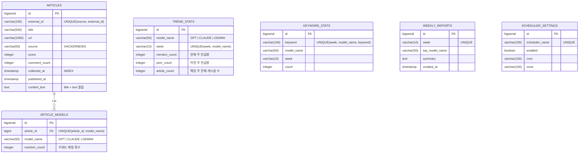

<p align="center">
  
  
  
  
  
</p>

# 🚀 BenchMark — AI 트렌드 대시보드

> **HackerNews Top Stories에서 GPT · Claude · Gemini 언급량을 자동 수집·분석하여, "이번 주 어떤 AI가 가장 핫한가?"를 한눈에 보여주는 개발자용 트렌드 대시보드**

---

## 📌 프로젝트 개요

BenchMark는 개발자 커뮤니티(HackerNews)에서 상위 인기 게시글(Top Stories)을 **자동 수집**하고, 게시글 제목·본문에서 AI 모델 키워드를 **분석·집계**하여 주간 트렌드를 시각화하는 **풀스택 웹 애플리케이션**입니다.

### 💡 왜 만들었나?

- 매일 HackerNews를 직접 뒤지지 않고도 **AI 모델별 언급 동향**을 한눈에 파악하고 싶었습니다
- 단순 CRUD가 아닌 **외부 API 연동 → 데이터 분석 → 집계 → 시각화**까지 이어지는 실전 파이프라인을 구현하고 싶었습니다
- **디자인 패턴(Chain of Responsibility)**, **비동기 병렬 처리**, **DB 기반 동적 스케줄러** 등 실무에서 필요한 기술을 적용하고 싶었습니다

---

## 🎯 핵심 기능 상세

### 1️⃣ HackerNews 자동 수집 엔진

| 항목 | 설명 |
|------|------|
| **수집 대상** | HackerNews Top Stories (상위 30개) |
| **API 클라이언트** | `RestClient` + `CompletableFuture` 8스레드 병렬 호출 |
| **수집 주기** | `SchedulingConfigurer` 기반 동적 Cron (기본: 매일 09:00 KST) |
| **중복 방지** | `source + external_id` 유니크 제약조건으로 DB 레벨 보장 |
| **결과 통계** | fetched · saved · aiMatched · duplicate · invalid · skipped 6개 지표 추적 |

> 📡 **수집 파이프라인**: HackerNews Firebase API `/v0/topstories.json` → 개별 아이템 `/v0/item/{id}.json` → 평가 → 핸들러 체인 → DB 저장

### 2️⃣ AI 모델 키워드 분석

게시글의 **`title + text`** 에서 아래 키워드를 감지하면 해당 모델의 언급으로 카운트합니다:

| AI 모델 | 감지 키워드 |
|---------|------------|
| **GPT** | `gpt`, `gpt-4`, `gpt-4o`, `chatgpt`, `openai` |
| **Claude** | `claude`, `anthropic`, `claude-3`, `sonnet`, `opus` |
| **Gemini** | `gemini`, `google ai`, `bard`, `gemini pro` |

- 하나의 게시글이 **여러 모델을 동시에 언급**할 수 있습니다 (예: "GPT vs Claude 비교")
- 단순 포함 여부가 아닌 **언급 강도(mention_count)**를 함께 저장합니다

### 3️⃣ 주간 트렌드 집계

- 수집 완료 시 **현재 주 + 이전 주** 언급량을 동시에 집계합니다
- **전주 대비 증감률(%)**을 자동 계산하여 대시보드에 표시합니다
- `2025-W11` 형식의 ISO 주차 기준으로 관리합니다

### 4️⃣ 관리자 대시보드

| 기능 | URL | 설명 |
|------|-----|------|
| 관리자 메인 | `/admin/main` | 현재 스케줄러 상태 확인 |
| 스케줄 설정 | `/admin/schedule` | 수집 스케줄 ON/OFF, 실행 시간·타임존 변경 |
| 수동 수집 | `POST /api/collect/hacker-news` | 버튼 클릭으로 즉시 수집 트리거 |

### 5️⃣ 메인 대시보드 (사용자 화면)

| 섹션 | 설명 |
|------|------|
| **Automatic Collection** | 스케줄러 ON/OFF 상태, 다음 실행 시간 표시 |
| **This Week** | 모델별 주간 언급량 랭킹 + 전주 대비 증감률 |
| **Recent Articles** | 수집된 게시글 Top 5 (최신순/점수순 정렬, AJAX 비동기 전환) |

---

## 🏗 아키텍처 & 데이터 흐름

```
┌─────────────────────────────────────────────────────────────────────┐
│                       Spring Scheduler                              │
│            (SchedulingConfigurer — DB 기반 동적 Cron)               │
└────────────────────────────┬────────────────────────────────────────┘
                             │ 트리거
                             ▼
┌─────────────────────────────────────────────────────────────────────┐
│                    CollectService                                    │
│                                                                     │
│  ① HackerNewsClient.fetchTopStoryIds(30)                           │
│       └─ RestClient → GET /v0/topstories.json                      │
│                                                                     │
│  ② HackerNewsClient.fetchItems(ids)                                │
│       └─ CompletableFuture × 8 스레드 병렬 호출                     │
│       └─ GET /v0/item/{id}.json (개별 조회)                         │
│                                                                     │
│  ③ 각 아이템 → Chain of Responsibility 핸들러 체인                  │
│       ┌──────────────────────────────────────────┐                  │
│       │  @Order(1) InvalidHandler   → INVALID    │                  │
│       │  @Order(2) NonAiHandler     → NON_AI     │                  │
│       │  @Order(3) DuplicateHandler → DUPLICATE  │                  │
│       │  @Order(4) SaveHandler      → SAVED      │ ← DB 저장       │
│       └──────────────────────────────────────────┘                  │
│                                                                     │
│  ④ TrendAggregationService.refreshCurrentWeekStats()               │
│       └─ 현재 주 + 이전 주 모델별 언급량 재집계                     │
└─────────────────────────────────────────────────────────────────────┘
                             │
                             ▼
┌─────────────────────────────────────────────────────────────────────┐
│                    PostgreSQL (Neon Cloud)                           │
│                                                                     │
│    articles ──1:N──▶ article_models                                 │
│    trend_stats        keyword_stats        weekly_reports           │
│    scheduler_settings                                               │
└────────────────────────────┬────────────────────────────────────────┘
                             │
                             ▼
┌─────────────────────────────────────────────────────────────────────┐
│               사용자 접속 (Thymeleaf SSR + Vanilla JS)              │
│                                                                     │
│    GET /           → 메인 대시보드 (SSR)                            │
│    GET /api/articles → AJAX 비동기 정렬 전환                        │
│    GET /admin/*    → 관리자 페이지                                  │
└─────────────────────────────────────────────────────────────────────┘
```

---

## 🔧 핵심 디자인 패턴

### Chain of Responsibility — 수집 아이템 처리 파이프라인

수집된 HackerNews 아이템은 **4단계 핸들러 체인**을 순서대로 거치며, 첫 번째로 `supports()` 조건을 만족하는 핸들러가 처리합니다:

```
HackerNewsItemDto
    │
    ▼
┌───────────────────────────┐
│ ① InvalidHandler (@Order 1)│ ─── 삭제/비공개/제목없음 → INVALID (스킵)
└────────────┬──────────────┘
             ▼
┌───────────────────────────┐
│ ② NonAiHandler  (@Order 2)│ ─── AI 키워드 미포함 → NON_AI (스킵)
└────────────┬──────────────┘
             ▼
┌───────────────────────────┐
│ ③ DuplicateHandler(@Order 3)│ ─── DB에 이미 존재 → DUPLICATE (스킵)
└────────────┬──────────────┘
             ▼
┌───────────────────────────┐
│ ④ SaveHandler   (@Order 4)│ ─── 모든 검증 통과 → 저장 → SAVED ✅
└───────────────────────────┘
```

**왜 이 패턴을 적용했나?**

- **개방-폐쇄 원칙(OCP)**: 새로운 필터 조건이 생기면 핸들러 클래스만 하나 추가하면 됩니다
- **단일 책임 원칙(SRP)**: 각 핸들러는 하나의 판단 기준만 담당합니다
- **Spring `@Order`** 애노테이션으로 실행 순서를 선언적으로 관리합니다

### Strategy Pattern — 서비스 인터페이스 분리

모든 서비스가 **인터페이스 + 구현체** 형태로 분리되어 있어 테스트 용이성과 교체 가능성을 확보합니다:

```
CollectService ──▶ CollectServiceImpl
HackerNewsClient ──▶ HackerNewsClientImpl
ArticleModelAnalyzer ──▶ ArticleModelAnalyzerImpl
ArticleService ──▶ ArticleServiceImpl
TrendService ──▶ TrendServiceImpl
SchedulerSettingsService ──▶ SchedulerSettingsServiceImpl
```

---

## 🛠 기술 스택

### Backend

| 구분 | 기술 | 사용 목적 |
|------|------|----------|
| **Language** | Java 17 | Record 클래스, 텍스트 블록 등 모던 문법 활용 |
| **Framework** | Spring Boot 3.3.2 | 자동 설정, 내장 톰캣, DI/AOP |
| **ORM** | Spring Data JPA (Hibernate) | 엔티티 매핑, JPQL 커스텀 쿼리, Pageable |
| **Template** | Thymeleaf | 서버 사이드 렌더링, 조건부 렌더링 |
| **HTTP Client** | RestClient | HackerNews API 동기 호출 (Spring 6.1+) |
| **Async** | CompletableFuture + ExecutorService | 8스레드 병렬 API 호출 |
| **Scheduling** | SchedulingConfigurer + CronTrigger | DB 기반 동적 스케줄 관리 |
| **Utility** | Lombok | 보일러플레이트 코드 제거 |

### Database & Infra

| 구분 | 기술 | 사용 목적 |
|------|------|----------|
| **DB** | PostgreSQL (Neon Cloud) | 클라우드 호스팅, SSL 연결, Connection Pooling |
| **DDL** | JPA `ddl-auto: update` | 개발 시 자동 스키마 생성 |
| **Build** | Gradle 8.x | 의존성 관리, 빌드 자동화 |

### Frontend

| 구분 | 기술 | 사용 목적 |
|------|------|----------|
| **SSR** | Thymeleaf | 초기 페이지 서버 렌더링 |
| **Client JS** | Vanilla JavaScript (ES2020+) | Fetch API 기반 AJAX 비동기 갱신 |
| **CSS** | Custom CSS (`app.css`) | 커스텀 디자인 시스템 |

---

## 🗄 ERD (데이터 모델)



### 테이블별 역할

| 테이블 | 역할 | 핵심 제약조건 |
|--------|------|--------------|
| `articles` | 외부 소스에서 수집한 원본 게시글 | `UK(source, external_id)` — 중복 수집 방지 |
| `article_models` | 게시글-AI모델 매핑 (1:N) | `UK(article_id, model_name)` — 모델별 1레코드 |
| `trend_stats` | 주간 모델별 집계 결과 (대시보드용) | `UK(week, model_name)` — 주차-모델 단위 유일 |
| `keyword_stats` | 모델별 주간 키워드 빈도 | `UK(week, model_name, keyword)` |
| `weekly_reports` | 주간 요약 리포트 | `UK(week)` — 주당 1개 리포트 |
| `scheduler_settings` | 스케줄러 동적 설정 (DB 저장) | `UK(scheduler_name)` |

---

## 📁 패키지 구조

```
src/main/java/kr/co/glab/benchmark/
│
├── 📂 config/
│   └── SchedulerProperties.java          # @ConfigurationProperties — YAML 바인딩
│
├── 📂 controller/
│   ├── HomeController.java               # GET / — 메인 대시보드
│   ├── AdminController.java              # GET /admin/main, /admin/schedule
│   ├── AdminScheduleController.java      # POST /admin/schedule — 스케줄 CRUD
│   └── 📂 api/
│       ├── TrendApiController.java       # GET /api/trends/summary, /api/articles
│       └── CollectApiController.java     # POST /api/collect/hacker-news
│
├── 📂 service/
│   ├── CollectService[Impl].java         # 수집 오케스트레이션
│   ├── HackerNewsClient[Impl].java       # HN API 호출 (RestClient + 병렬)
│   ├── HackerNewsItemEvaluator[Impl].java# 아이템 유효성 + AI 분석 평가
│   ├── ArticleModelAnalyzer[Impl].java   # AI 모델 키워드 매칭 엔진
│   ├── ArticleIngestionService[Impl].java# Article + ArticleModel DB 저장
│   ├── ArticleService[Impl].java         # 게시글 조회 (정렬/페이징)
│   ├── TrendService[Impl].java           # 트렌드 요약 조회 + 증감률 계산
│   ├── TrendAggregationService[Impl].java# 주간 집계 로직
│   ├── WeekService[Impl].java            # ISO 주차 계산 유틸
│   ├── SchedulerSettingsService[Impl].java# DB 기반 스케줄 설정 관리
│   │
│   ├── 📂 Chain of Responsibility 핸들러
│   │   ├── HackerNewsItemProcessHandler.java       # 핸들러 인터페이스
│   │   ├── InvalidHackerNewsItemProcessHandler.java # @Order(1) 무효 아이템
│   │   ├── NonAiHackerNewsItemProcessHandler.java   # @Order(2) 비AI 아이템
│   │   ├── DuplicateHackerNewsItemProcessHandler.java# @Order(3) 중복 체크
│   │   └── SaveHackerNewsItemProcessHandler.java    # @Order(4) 저장
│   │
│   ├── HackerNewsItemEvaluation.java     # 평가 결과 VO (팩토리 메서드)
│   ├── HackerNewsItemProcessContext.java # 핸들러 컨텍스트
│   ├── HackerNewsItemProcessStatus.java  # SAVED | DUPLICATE | INVALID | NON_AI
│   └── HackerNewsCollectAccumulator.java # 수집 통계 누적기
│
├── 📂 scheduler/
│   └── CollectSchedulingConfig.java      # SchedulingConfigurer — 동적 Cron
│
├── 📂 entity/
│   ├── Article.java                      # 수집 게시글 (인덱스 + UK 설정)
│   ├── ArticleModel.java                 # 게시글-AI모델 매핑 (@ManyToOne)
│   ├── KeywordStat.java                  # 키워드 주간 집계
│   ├── TrendStat.java                    # 모델별 주간 집계
│   ├── WeeklyReport.java                 # 주간 리포트
│   └── SchedulerSetting.java            # 스케줄러 설정
│
├── 📂 dto/
│   ├── TrendSummaryDto.java              # 주간 트렌드 요약 (record)
│   ├── ArticleSummaryDto.java            # 게시글 요약 (record)
│   ├── HackerNewsItemDto.java            # HN API 응답 (record)
│   ├── HackerNewsCollectStatsDto.java    # 수집 통계 (record)
│   └── HackerNewsCollectResponseDto.java # 수집 API 응답 (record)
│
├── 📂 repository/
│   ├── ArticleRepository.java            # findBySourceAndExternalId, JPQL
│   ├── ArticleModelRepository.java       # findByArticleCollectedAtBetween
│   ├── TrendStatRepository.java          # findByWeekAndModelName
│   ├── KeywordStatRepository.java
│   ├── WeeklyReportRepository.java
│   └── SchedulerSettingRepository.java   # findBySchedulerName
│
└── BenchMarkApplication.java            # @EnableScheduling, @ConfigurationProperties

src/main/resources/
├── application.yml                       # DB, JPA, 스케줄러 설정
└── 📂 templates/
    ├── home.html                         # 메인 대시보드
    └── 📂 admin/
        ├── index.html                    # 관리자 메인
        └── schedule.html                 # 스케줄 설정 폼
```

---

## 🌐 API 엔드포인트

### MVC 페이지 라우팅

| Method | URL | Controller | 설명 |
|--------|-----|------------|------|
| `GET` | `/` | `HomeController` | 메인 대시보드 (트렌드 요약 + 최근 게시글) |
| `GET` | `/admin` | `AdminController` | → `/admin/main` 리다이렉트 |
| `GET` | `/admin/main` | `AdminController` | 관리자 메인 (스케줄러 상태) |
| `GET` | `/admin/schedule` | `AdminController` | 스케줄 설정 페이지 |
| `POST` | `/admin/schedule` | `AdminScheduleController` | 스케줄 변경 (AM/PM, 시, 분, 초, 타임존) |

### REST API

| Method | URL | Controller | 설명 |
|--------|-----|------------|------|
| `GET` | `/api/trends/summary` | `TrendApiController` | 현재 주 모델별 언급량 요약 (JSON) |
| `GET` | `/api/articles?sort=latest\|score` | `TrendApiController` | 최근 게시글 Top 5 (정렬 옵션) |
| `POST` | `/api/collect/hacker-news` | `CollectApiController` | 수동 수집 트리거 → 통계 + 갱신된 데이터 반환 |

#### 수집 API 응답 예시

```json
{
  "message": "Hacker News 수집 완료: 30건 조회, 5건 저장, 3건 AI 매칭, 2건 중복, 10건 무효, 10건 스킵",
  "stats": {
    "fetchedCount": 30,
    "savedCount": 5,
    "aiMatchedCount": 3,
    "duplicateCount": 2,
    "invalidCount": 10,
    "skippedCount": 10
  },
  "summary": [...],
  "articles": [...]
}
```

---

## ⏰ 스케줄러 동작 방식

BenchMark의 스케줄러는 일반적인 `@Scheduled` 고정 Cron이 아니라, **DB에서 설정을 읽어 동적으로 Cron을 변경**할 수 있는 구조입니다:

```
┌─────────────────────────────────────────────────────┐
│          CollectSchedulingConfig                     │
│          implements SchedulingConfigurer             │
│                                                     │
│  ┌───────────────────────────────────┐              │
│  │  Trigger.nextExecution()          │              │
│  │    ① DB에서 SchedulerSetting 조회 │              │
│  │    ② enabled = false → 1분 후 재확인│             │
│  │    ③ enabled = true  → CronTrigger│              │
│  │       적용하여 다음 실행 시각 계산 │              │
│  └───────────────────────────────────┘              │
│                                                     │
│  첫 실행 시 DB에 행이 없으면                         │
│  application.yml 기본값으로 자동 생성               │
└─────────────────────────────────────────────────────┘
```

| 설정 항목 | 기본값 | 변경 방법 |
|-----------|--------|----------|
| **enabled** | `true` | 관리자 페이지 토글 or `application.yml` |
| **cron** | `0 0 9 * * *` (매일 09:00) | 관리자 페이지 시간 입력 |
| **zone** | `Asia/Seoul` | 관리자 페이지 타임존 선택 |

---

## 🔑 환경 변수

| 변수명 | 기본값 | 설명 |
|--------|--------|------|
| `DB_URL` | `jdbc:postgresql://localhost:5432/benchmark` | PostgreSQL 접속 URL |
| `DB_USERNAME` | `benchmark` | DB 사용자명 |
| `DB_PASSWORD` | `benchmark` | DB 비밀번호 |
| `JPA_DDL_AUTO` | `update` | 스키마 자동 생성 전략 |
| `LOG_SQL` | `debug` | Hibernate SQL 로깅 레벨 |
| `HACKER_NEWS_SCHEDULER_ENABLED` | `true` | 스케줄러 활성화 여부 |
| `HACKER_NEWS_SCHEDULER_CRON` | `0 0 9 * * *` | 수집 Cron 표현식 |
| `HACKER_NEWS_SCHEDULER_ZONE` | `Asia/Seoul` | 스케줄러 타임존 |

---

## 🚀 실행 방법

### 사전 요구사항

- **Java 17+** (JDK)
- **PostgreSQL** (로컬 or 클라우드, Neon 권장)

### 로컬 실행

```bash
# 1. 저장소 클론
git clone https://github.com/your-username/benchmark.git
cd benchmark

# 2. 환경변수 파일 생성
# .env 파일에 DB 접속 정보 설정
cat > .env << EOF
DB_URL=jdbc:postgresql://localhost:5432/benchmark
DB_USERNAME=benchmark
DB_PASSWORD=your_password
EOF

# 3. 실행 (Gradle Wrapper 사용)
./gradlew bootRun

# 4. 브라우저 접속
# http://localhost:8080        — 메인 대시보드
# http://localhost:8080/admin  — 관리자 페이지
```

### Neon PostgreSQL 클라우드 사용 시

```bash
# .env 파일에 Neon 접속 정보 설정
DB_URL=jdbc:postgresql://ep-xxx.us-east-1.aws.neon.tech/neondb?sslmode=require&channel_binding=require
DB_USERNAME=neondb_owner
DB_PASSWORD=your_neon_password
```

---

## 📊 Gradle 의존성 (build.gradle)

```groovy
dependencies {
    // Spring Boot 핵심
    implementation 'org.springframework.boot:spring-boot-starter-web'
    implementation 'org.springframework.boot:spring-boot-starter-data-jpa'
    implementation 'org.springframework.boot:spring-boot-starter-thymeleaf'

    // Database
    runtimeOnly 'org.postgresql:postgresql'

    // Utility
    compileOnly 'org.projectlombok:lombok'
    annotationProcessor 'org.projectlombok:lombok'

    // 개발 편의
    developmentOnly 'org.springframework.boot:spring-boot-devtools'

    // 테스트
    testImplementation 'org.springframework.boot:spring-boot-starter-test'
}
```

---

## 💡 기술적 어필 포인트

### 🎨 설계 패턴 적용

| 패턴 | 적용 위치 | 이유 |
|------|----------|------|
| **Chain of Responsibility** | `HackerNewsItemProcessHandler` 4종 | 필터 조건 확장 용이, SRP 준수 |
| **Strategy** | 서비스 인터페이스/구현체 분리 (10쌍) | 테스트 용이, 구현체 교체 가능 |
| **Factory Method** | `HackerNewsItemEvaluation.invalid/nonAi/matched` | 평가 결과 생성을 의미 있는 메서드로 캡슐화 |
| **Template Method** | `HackerNewsItemProcessHandler.supports → handle → log` | 핸들러 처리 흐름 표준화 |

### ⚡ 비동기 병렬 처리

```java
// HackerNewsClientImpl.java — 8스레드 병렬 API 호출
private final ExecutorService executorService = Executors.newFixedThreadPool(8);

public List<HackerNewsItemDto> fetchItems(List<Long> ids) {
    return ids.stream()
        .map(id -> CompletableFuture.supplyAsync(() -> fetchItemSafely(id), executorService))
        .toList().stream()
        .map(CompletableFuture::join)
        .filter(item -> item != null)
        .toList();
}
```

- 30개 아이템을 순차 호출하면 ~30초 소요 → **8스레드 병렬로 ~4초**로 단축
- `@PreDestroy`로 ExecutorService 안전 종료 보장

### 🔄 동적 스케줄러 (런타임 Cron 변경)

- `@Scheduled(cron = "...")` 대신 `SchedulingConfigurer` 구현
- **매 실행마다 DB에서 Cron 표현식을 읽어** 다음 실행 시각 동적 결정
- 관리자 페이지에서 스케줄을 변경하면 **재배포 없이 즉시 반영**

### 📝 Java Record 활용

- DTO 전체를 **Java Record**로 선언 → 보일러플레이트 제거
- `TrendSummaryDto`, `ArticleSummaryDto`, `HackerNewsItemDto`, `HackerNewsCollectStatsDto`, `SchedulerSettingsView`

### 🔐 XSS 방어

- 클라이언트 사이드 동적 렌더링 시 `escapeHtml()` / `escapeAttribute()` 함수로 HTML 이스케이프 처리
- Thymeleaf `th:text`는 기본적으로 자동 이스케이프

---

## 📄 라이선스

이 프로젝트는 포트폴리오 용도로 제작되었습니다.
