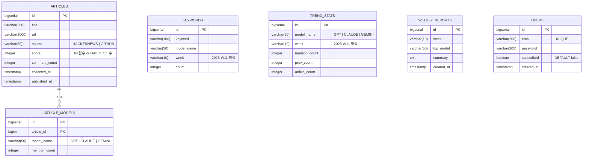

# 🚀 BenchMark

> GitHub · HackerNews에서 AI 트렌드를 자동 수집하고, GPT · Claude · Gemini 언급량 · 맥락을 분석해서 보여주는 **개발자용 AI 트렌드 대시보드**

<br>

## 📌 프로젝트 소개

BenchMark는 개발자 커뮤니티(HackerNews, GitHub Trending)에서 AI 모델 관련 데이터를 **자동 수집·분석**하여,  
**"이번 주 어떤 AI 모델이 가장 핫한가?"** 를 한눈에 보여주는 트렌드 대시보드입니다.

- 📊 개발자 커뮤니티에서 어떤 AI가 얼마나, 어떤 맥락에서 언급되는지를 **데이터로 분석**합니다

<br>

## 🎯 핵심 기능

| 기능 | 설명 |
|------|------|
| **AI 모델별 언급량 비교** | GPT · Claude · Gemini 주간 언급량 랭킹 + 증감률 |
| **트렌드 추이 차트** | 날짜별 · 출처별 언급량 라인차트 |
| **키워드 빈도 분석** | 함께 등장하는 키워드 Top 10 (#agent, #reasoning 등) |
| **핫 게시글 목록** | HackerNews · GitHub Trending 수집 게시글 리스트 |
| **모델별 상세 페이지** | 각 AI 모델의 누적 통계 + 관련 게시글 |
| **주간 리포트 자동 생성** | 매주 월요일 AI 트렌드 요약 리포트 |
| **이메일 구독** | 주간 리포트 자동 발송 |

<br>

## 🛠 기술 스택

### Backend
| 구분 | 기술 |
|------|------|
| Language | Java 17 |
| Framework | Spring Boot 3.3.2 |
| ORM | Spring Data JPA (Hibernate) |
| Template | Thymeleaf + Thymeleaf Extras Security |
| Security | Spring Security 6 + JWT (jjwt 0.12.5) |
| Batch | Spring Batch |
| Cache | Spring Data Redis |
| HTTP Client | Spring WebFlux (WebClient) |
| HTML Parsing | Jsoup 1.17.2 |
| Mail | Spring Boot Mail |

### Database & Infra
| 구분 | 기술 |
|------|------|
| DB | PostgreSQL |
| Cache | Redis |
| Build | Gradle |
| Deploy | Docker + Docker Compose |

### Frontend
| 구분 | 기술 |
|------|------|
| Template Engine | Thymeleaf |
| Chart | Chart.js |
| CSS | Bootstrap 5 |

<br>

## 📱 화면 구성 (총 6개)

| 번호 | 화면 | URL | 설명 |
|------|------|-----|------|
| 1 | 메인 대시보드 | `/` | AI 모델별 주간 언급량 랭킹, 증감률, 마지막 수집 시간 |
| 2 | 트렌드 상세 | `/trend` | 기간별·출처별 언급량 추이 차트, 출처 비율, 키워드 Top 10 |
| 3 | 핫 게시글 목록 | `/articles` | 수집된 게시글 리스트 (검색·필터·페이징) |
| 4 | 모델별 상세 | `/model/{name}` | GPT/Claude/Gemini 누적 통계, 관련 키워드, 최신 게시글 |
| 5 | 주간 리포트 | `/report` | 자동 생성 주간 AI 트렌드 요약, 주요 뉴스 Top 5 |
| 6 | 로그인/회원가입 | `/login` `/register` | 이메일 구독 등 인증 필요 기능용 |

<br>

## 🗄 ERD (테이블 설계)



### SQL DDL

```sql
-- 수집된 게시글
CREATE TABLE articles (
    id            BIGSERIAL PRIMARY KEY,
    title         VARCHAR(500)      NOT NULL,
    url           VARCHAR(1000)     NOT NULL,
    source        VARCHAR(50)       NOT NULL,   -- 'HACKERNEWS' | 'GITHUB'
    score         INTEGER           DEFAULT 0,
    comment_count INTEGER           DEFAULT 0,
    collected_at  TIMESTAMP         NOT NULL,
    published_at  TIMESTAMP
);

-- 게시글-AI모델 연관
CREATE TABLE article_models (
    id            BIGSERIAL PRIMARY KEY,
    article_id    BIGINT            NOT NULL REFERENCES articles(id),
    model_name    VARCHAR(50)       NOT NULL,   -- 'GPT' | 'CLAUDE' | 'GEMINI'
    mention_count INTEGER           DEFAULT 1
);

-- 키워드 빈도
CREATE TABLE keywords (
    id            BIGSERIAL PRIMARY KEY,
    keyword       VARCHAR(100)      NOT NULL,
    model_name    VARCHAR(50),
    week          VARCHAR(10)       NOT NULL,   -- '2025-W11' 형식
    count         INTEGER           DEFAULT 1
);

-- 모델별 주간 언급량 집계
CREATE TABLE trend_stats (
    id            BIGSERIAL PRIMARY KEY,
    model_name    VARCHAR(50)       NOT NULL,   -- 'GPT' | 'CLAUDE' | 'GEMINI'
    week          VARCHAR(10)       NOT NULL,   -- '2025-W11' 형식
    mention_count INTEGER           DEFAULT 0,
    prev_count    INTEGER           DEFAULT 0,
    article_count INTEGER           DEFAULT 0
);

-- 주간 리포트
CREATE TABLE weekly_reports (
    id            BIGSERIAL PRIMARY KEY,
    week          VARCHAR(10)       NOT NULL,
    top_model     VARCHAR(50),
    summary       TEXT,
    created_at    TIMESTAMP         DEFAULT CURRENT_TIMESTAMP
);

-- 사용자 (이메일 구독용)
CREATE TABLE users (
    id            BIGSERIAL PRIMARY KEY,
    email         VARCHAR(200)      NOT NULL UNIQUE,
    password      VARCHAR(200)      NOT NULL,
    subscribed    BOOLEAN           DEFAULT false,
    created_at    TIMESTAMP         DEFAULT CURRENT_TIMESTAMP
);
```

<br>

## 📁 패키지 구조

```
src/main/java/kr/co/glab/benchmark/
├── config/
│   ├── SecurityConfig.java              # JWT 필터, 인증 설정
│   ├── RedisConfig.java                 # Redis 캐시 설정
│   ├── BatchConfig.java                 # Spring Batch Job 설정
│   ├── WebClientConfig.java             # HackerNews API 클라이언트
│   └── MailConfig.java                  # SMTP 설정
│
├── controller/
│   ├── HomeController.java              # / 메인 대시보드
│   ├── TrendController.java             # /trend 트렌드 상세
│   ├── ArticleController.java           # /articles 게시글 목록
│   ├── ModelController.java             # /model/{name} 모델별 상세
│   ├── ReportController.java            # /report 주간 리포트
│   ├── AuthController.java              # /login, /register
│   └── api/
│       └── TrendApiController.java      # REST API (차트 데이터용)
│
├── service/
│   ├── CollectService.java              # 수집 비즈니스 로직
│   ├── TrendService.java                # 트렌드 집계 로직
│   ├── ArticleService.java              # 게시글 조회/검색
│   ├── ReportService.java               # 주간 리포트 생성
│   ├── MailService.java                 # 이메일 발송
│   ├── AuthService.java                 # 회원가입/로그인
│   └── JwtService.java                  # JWT 발급/검증
│
├── batch/
│   ├── HackerNewsCollectJob.java        # HN 수집 배치 Job
│   ├── GitHubCollectJob.java            # GitHub 수집 배치 Job
│   ├── KeywordAnalyzeJob.java           # 키워드 분석 배치 Job
│   └── WeeklyReportJob.java             # 주간 리포트 생성 배치
│
├── scheduler/
│   └── CollectScheduler.java            # @Scheduled 수집 스케줄러
│
├── repository/
│   ├── ArticleRepository.java
│   ├── ArticleModelRepository.java
│   ├── KeywordRepository.java
│   ├── TrendStatRepository.java
│   ├── WeeklyReportRepository.java
│   └── UserRepository.java
│
├── entity/
│   ├── Article.java                     # 수집된 게시글
│   ├── ArticleModel.java                # 게시글-AI모델 연관
│   ├── Keyword.java                     # 키워드
│   ├── TrendStat.java                   # 주간 집계 결과
│   ├── WeeklyReport.java                # 주간 리포트
│   └── User.java                        # 사용자
│
├── dto/
│   ├── TrendSummaryDto.java
│   ├── ArticleDto.java
│   ├── ModelStatDto.java
│   └── WeeklyReportDto.java
│
├── client/
│   ├── HackerNewsClient.java            # HN API 호출
│   └── GitHubClient.java                # GitHub API 호출 + Jsoup 파싱
│
├── security/
│   ├── JwtAuthFilter.java               # JWT 필터
│   └── CustomUserDetailsService.java
│
└── BenchMarkApplication.java
```

<br>

## 🌐 API 엔드포인트

### MVC 페이지

| Method | URL | 설명 |
|--------|-----|------|
| `GET` | `/` | 메인 대시보드 |
| `GET` | `/trend` | 트렌드 상세 (필터/기간) |
| `GET` | `/articles` | 게시글 목록 (검색/페이징) |
| `GET` | `/model/{name}` | 모델별 상세 (GPT, CLAUDE, GEMINI) |
| `GET` | `/report` | 주간 리포트 목록 |
| `GET` | `/login` | 로그인 페이지 |
| `POST` | `/login` | 로그인 처리 |
| `GET` | `/register` | 회원가입 페이지 |
| `POST` | `/register` | 회원가입 처리 |
| `POST` | `/subscribe` | 이메일 구독 (로그인 필요) |

### REST API (차트 데이터용)

| Method | URL | 설명 |
|--------|-----|------|
| `GET` | `/api/trends/summary` | 모델별 이번 주 언급량 요약 |
| `GET` | `/api/trends/weekly?model=GPT` | 특정 모델 주간 추이 |
| `GET` | `/api/trends/keywords?week=2025-W11` | 해당 주 키워드 랭킹 |
| `GET` | `/api/articles?page=0&source=HACKERNEWS` | 게시글 목록 (페이징) |
| `GET` | `/api/models/{name}/stat` | 모델별 누적 통계 |

<br>

## 🔄 데이터 흐름

```
[Spring Batch — 매일 새벽 2시]
         │
         ▼
HackerNews API ──┐
GitHub API ──────┼──▶ 수집 → AI 모델 키워드 추출 → DB 저장
Jsoup 파싱 ──────┘
         │
         ▼
[사용자 접속]
         │
         ▼
Redis 캐시 확인 ──▶ 있으면 캐시 반환
         │
         ▼ (없으면)
DB 조회 → 집계 → Redis 캐시 저장 → 화면 표시
```

<br>

## 🔑 AI 모델 키워드 감지 로직

| 모델 | 감지 키워드 |
|------|------------|
| **GPT** | `gpt`, `gpt-4`, `gpt-4o`, `chatgpt`, `openai` |
| **Claude** | `claude`, `anthropic`, `claude-3`, `sonnet`, `opus` |
| **Gemini** | `gemini`, `google ai`, `bard`, `gemini pro` |

> 게시글 제목 및 본문에서 위 키워드가 감지되면 해당 AI 모델의 언급으로 카운트합니다.

<br>

## ⏰ 수집 스케줄

| 시간 | 작업 |
|------|------|
| 매일 02:00 | HackerNews Top Stories 수집 |
| 매일 02:30 | GitHub Trending 수집 |
| 매일 03:00 | 키워드 분석 배치 |
| 매주 월 08:00 | 주간 리포트 자동 생성 |
| 매주 월 09:00 | 구독자 이메일 발송 |

<br>

## 🗓 8주 개발 플랜

| 주차 | 목표 |
|------|------|
| **1주차** | JPA 엔티티 설계, DB 연결, 프로젝트 세팅 |
| **2주차** | JWT 인증 구현 (회원가입, 로그인) |
| **3주차** | HackerNews API 연동 + 데이터 수집 |
| **4주차** | GitHub Trending 파싱 + Spring Batch 설정 |
| **5주차** | 키워드 분석 로직 + 집계 쿼리 + Redis 캐싱 |
| **6주차** | 화면 구현 (대시보드, 트렌드, 게시글 목록) |
| **7주차** | 주간 리포트 자동 생성 + 이메일 발송 |
| **8주차** | Docker 배포, README 작성, 최종 마무리 |

<br>

## 💡 면접 어필 포인트

### 기술적 차별점
- **Spring Batch** — 대용량 데이터 수집/분석 자동화
- **Redis 캐싱** — DB 부하 최소화, 응답 속도 최적화
- **WebClient (비동기)** — RestTemplate 대신 비동기 HTTP 클라이언트 사용
- **Jsoup** — 정형 API 외에 HTML 파싱으로 비정형 데이터 수집
- **JWT 인증** — 세션 대신 토큰 기반 인증 구현

### 설계적 강점
- API 키 없이도 동작하는 아키텍처 설계
- 수집 → 분석 → 캐싱 → 표시의 명확한 데이터 파이프라인
- 배치 스케줄러로 자동화된 데이터 수집/리포트 생성
- ERD 설계 시 정규화와 집계 테이블 분리

### 어필 키워드
> `Spring Batch` `Redis` `WebClient` `Jsoup` `JWT` `비동기 처리` `데이터 파이프라인` `키워드 분석` `자동화` `스케줄링`

<br>

## 🚀 실행 방법

### 사전 요구사항
- Java 17+
- PostgreSQL
- Redis

### 실행

```bash
# 1. 저장소 클론
git clone https://github.com/your-username/benchmark.git
cd benchmark

# 2. 환경변수 파일 준비
cp .env.example .env

# 3. .env 수정
#    DB 접속 정보 설정

# 4. 실행
./gradlew bootRun
```

### Docker 실행

```bash
docker-compose up -d
```

<br>

## 📄 라이선스

이 프로젝트는 포트폴리오 용도로 제작되었습니다.
